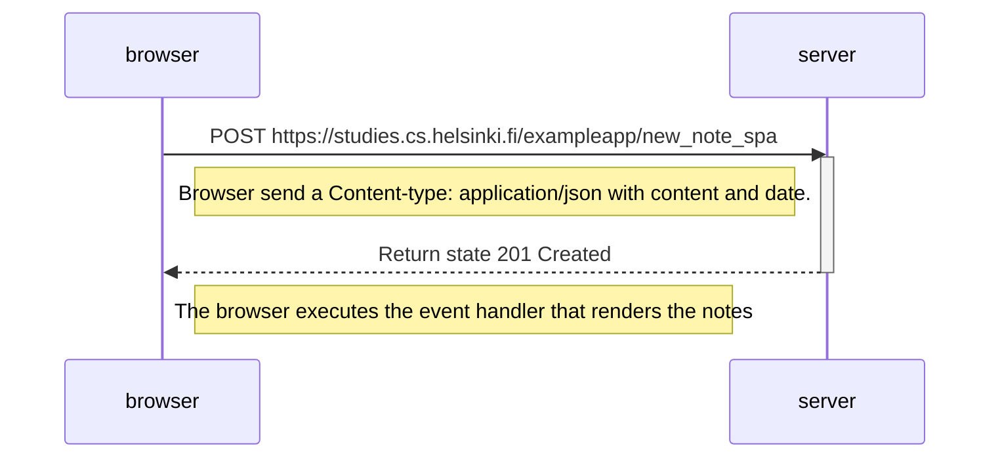

```mermaid
sequenceDiagram
    participant browser
    participant server

    browser->>server: POST https://studies.cs.helsinki.fi/exampleapp/new_note_spa
    activate server

    Note right of browser: Browser send a Content-type: application/json with content and date.

    server-->>browser: Return state 201 Created
    deactivate server

    Note right of browser: The browser executes the event handler that renders the notes
```
